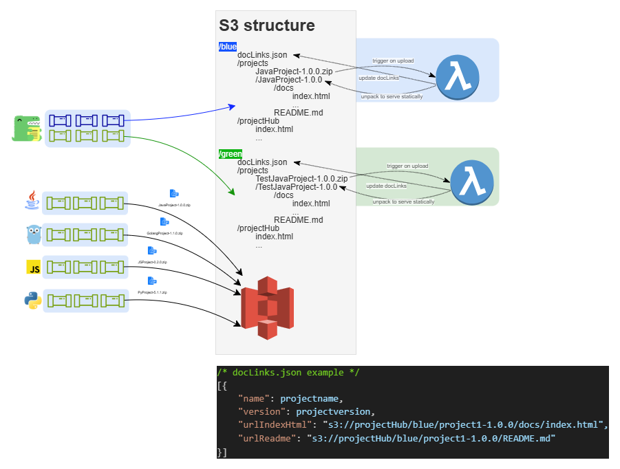

# Project Hub
Project which will aggregate your project's documentations and will serve as an entry point.

# Dev
The `cdk.json` file tells the CDK Toolkit how to execute your app.

## Useful CDK commands
* `npx cdk ls)`                                     list all stacks to be able deploy only one of them
* `npx cdk bootstrap -c targetEnv=(blue/green)`     bootstrap the environment before deployment
* `npx cdk diff -c targetEnv=(blue/green)`          compare deployed stack with current state
* `npx cdk synth -c targetEnv=(blue/green)`         to validate, catch errors and make synthesized CloudFormation template
* `npx cdk deploy -c targetEnv=(blue/green)`        deploy this stack to your (blue/green) AWS environment
* `npx cdk destroy -c targetEnv=(blue/green)`       destroy the whole (blue/green) AWS environment

## Useful NPM commands
* `npm install`                                     install packages
* `npm run build`                                   compile typescript to js
* `npm run watch`                                   watch for changes and compile
* `npm run test`                                    perform the jest unit tests
* `npx npm-check-updates`                           update all dependencies in package.json

## Useful AWS CLI commands
* `aws cloudfront create-invalidation --distribution-id <CF_DISTRIBUTION_ID> --paths '/*'`   invalidate CloudFront to quickly see changes
